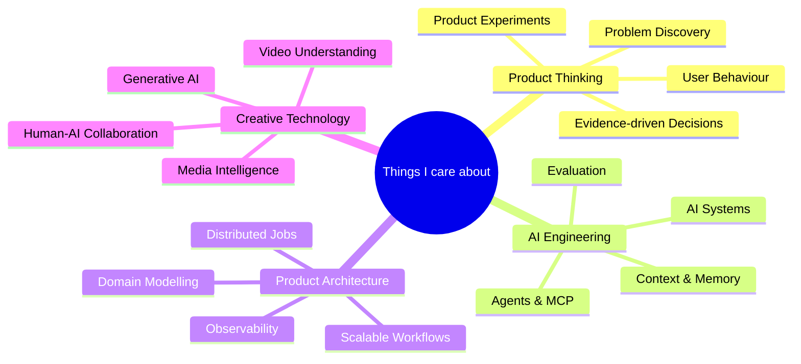
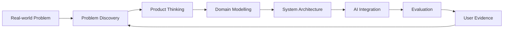
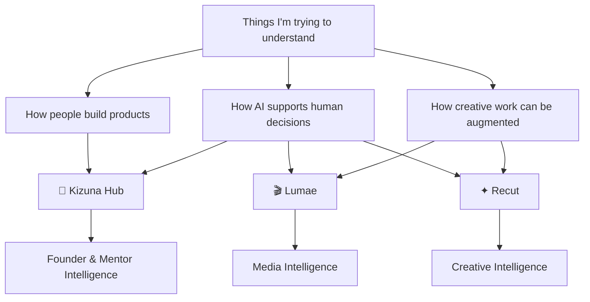

# 👋 Ohayou, I'm Ngoc

> I like building products not just to make software work, but to understand **why a problem exists, how people behave around it, and where technology can actually help.**

I'm a Computer Science student exploring the intersection of **Product Engineering, AI Systems, Human–AI Collaboration, and Creative Technology**.

Most of what I learn comes from building real products, breaking assumptions, redesigning them, and occasionally discovering that the problem I thought I was solving wasn't the actual problem. Software development has a charming habit of doing that.

---

## 🧭 What I care about



I'm especially interested in questions like:

- How do we turn a **messy real-world problem** into a product that people actually need?
- Where should AI make decisions, and where should humans stay in the loop?
- How can software preserve **context, evidence and reasoning**, instead of becoming another CRUD dashboard?
- How do AI systems move from impressive demos to **reliable production systems**?
- How can AI augment creative workflows without removing human creative control?

---

# 🚧 Currently Building

## 🌱 Kizuna Hub

**An evidence-driven workspace for student founders, mentors and universities.**

Kizuna explores how startup teams can move from vague advice and scattered documents toward a structured loop of:

```text
Context
   ↓
Identify Bottleneck
   ↓
Choose Next Action
   ↓
Mentor Support
   ↓
Execute
   ↓
Collect Evidence
   ↓
Evaluate Progress
   └──────────────↺
```

Things I'm exploring through Kizuna:

`Product Discovery` · `Founder Workflows` · `Human-in-the-loop AI` · `Mentor Matching` · `Evidence Systems` · `Domain Modelling` · `AI Context`

---

## 🎬 Lumae

**An AI-assisted creative workspace for understanding and editing video.**

Lumae is where I'm exploring the intersection between **media systems and AI**:

```text
Video
  ↓
Scene / Speech / Beat Understanding
  ↓
Creative Intelligence
  ↓
Hook Detection
  ↓
Timeline Decisions
  ↓
Caption · Reframe · Edit
  ↓
Human Refinement
```

Things I'm learning through Lumae:

`FFmpeg` · `Media Pipelines` · `ASR` · `Scene Detection` · `Auto Reframe` · `Timeline Systems` · `AI-assisted Editing`

---

## ✦ Recut

**A creative intelligence system for understanding products and producing better advertising concepts.**

Rather than treating generation as a single prompt → output step, Recut explores a deeper workflow:

```text
Product Context
      ↓
Research
      ↓
Creative Patterns
      ↓
Angles / Hooks / Scripts
      ↓
Generate Variants
      ↓
Visual QA
      ↓
Experiment
      ↓
Learn
```

The interesting problem isn't simply generating more content.

It's understanding **what should be generated, why it might work, and what we can learn from the result.**

Things I'm exploring through Recut:

`Creative Intelligence` · `AI Workflows` · `Product Understanding` · `Pattern Analysis` · `Generative AI` · `Evaluation` · `Visual QA`

---

# 🔬 What I'm Learning

My current learning path looks roughly like this:



### Product

Problem framing · Product discovery · User research · Jobs-to-be-Done · Experimentation · Evidence-driven iteration

### Engineering

System design · Domain modelling · Distributed workflows · Queues & workers · Storage · Observability

### AI

LLM systems · Context engineering · Agents · MCP · Retrieval · Evaluation · Human-in-the-loop systems

### Media Intelligence

Video processing · FFmpeg · ASR · Scene understanding · Creative analysis · Generative media

---

# 📈 Building & Learning

Instead of treating commits as the goal, I use GitHub mostly as a record of things I'm experimenting with, building, breaking, and understanding.


---

# 🧩 How my projects connect



Different products, but mostly the same curiosity:

> **How can we build systems that understand context well enough to help people make better decisions?**

---

# 📫 Find me

<p align="left">
  <a href="https://www.instagram.com/_sango.dono_">
    
  </a>
  <a href="mailto:knkidngoc@gmail.com">
    
  </a>
  <a href="https://www.linkedin.com/in/ngoc-nguyen-1a5036351/">
    
  </a>
</p>
